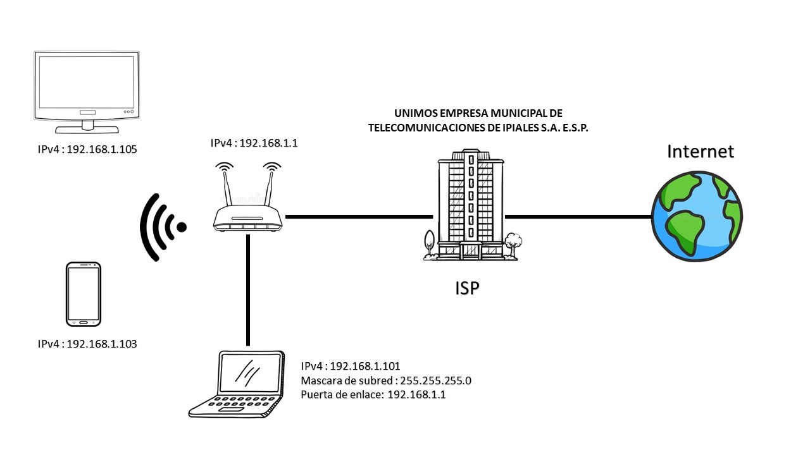

# Practica de laboratorio 01

<h3>
<code>Presentado por: </code> Jhohan Orlando Cabrera Chunata <code>  Código:</code> 218036018
 <h3>

## Objetivos 

### Objetivo General
Proporcionar el conocimiento y generar las habilidades necesarias en la configuración y gestión de dispositivos de redes.

### Objetivos Específicos:
- Conocer los números necesarios para configurar y caracterizar los diferentes dispositivos de red. :+1: 

---

## 2. [Preguntas de conocimiento](#) ✔

<ol type="a">
<li>¿Cual es la dirección de red y de broadcast de un host que tiene una ip 192.168.10.10/30 .?</li> 

<code><b>Respuesta:</b></code>

- La dirección de red de la ip 192.168.10.10/30 es 192.168.10.8
- La dirección de broadcast de la ip 192.168.10.10/30 es 192.168.10.11

 <li>¿Que información se puede inferir de la dirección 169.254.255.200/26?.</li>

<code><b>Respuesta:</b></code>

- Pertenece a la clase B con una máscara de subred 255.255.0.0, la cual permite un total de 62 clientes.

<r><li>¿Cuantas sub-redes puede lograr con la mascara 172.16.0.0/22?.</li>

<code><b>Respuesta:</b></code>

- Puede tener 1024 subredes distintas dentro de la red.

<r><li>¿Cuantos clienes puede tener la sub red 172.16.0.0/22?.</li>

<code><b>Respuesta:</b></code>

- La sub red 172.16.0.0/22 puede tener 1022 clientes.

 <li>¿Que clase y tipo de dirección es 10.10.10.0/24?.</li>

<code><b>Respuesta:</b></code>

- La dirección 10.10.10.0/24 es de tipo privada y de clase A (entre 1 y 126) , su primer octeto es 10 y su mascara de subred es la 255.0.0.0

</ol>

## 3. [Caracterización de los adaptadores](#) ✔
|Parámetro||Valor|
|--|:--:|--:|
|Número de adaptadores Físicos|-->|2|
|Número de adaptadores Virtuales|-->|1|
|Tipo de Adaptador principal|-->|Ethernet 802.3|
|Fabricante del Adaptador principal|-->|Realtek|
|Código MAC del fabricante|-->|D8-C4-97|
|MAC|-->|D8-C4-97-21-47-21|

>Nota: Para obtener los parámetros de la red, usaremos los comandos [ipconfig][10], [ifconfig][8], [getmac][9].

## 4. [Caracterización de la red](#) ✔
|Parámetro|Valor|
|--|--:|
|__Subnet__|192.168.1.0/24|
|IPv4|192.168.1.106|
|Subnet Mask decimal|24|
|Subnet Mask octetos|255.255.255.0|
|Número de direcciones de Host|254|
|Rango de direcciones de Host|192.168.1.1 - 254|
|IP Broadcast|192.168.1.255|
|Server DHCP|192.168.1.1|
|Server DNS|192.168.1.1|

>Nota: Para obtener los parámetros de la red, usaremos el comando [ipconfig][10] o [ifconfig][8].

## 5. [Caracterización de la puerta de enlace](#) ✔
|Parámetro|Valor|
|--|--:|
|Número de Entradas en la tabla ARP |7|
|IPv4 Gateway|192.168.1.1|
|MAC Gateway|B8-26-D4-43-54-4F|
|ISP|UNIMOS EMPRESA MUNICIPAL DE TELECOMUNICACIONES DE IPIALES S.A. E.S.P.|
|[IP Publica][5]|45.179.162.245|
|Sistema Autónomo|AS269743|

>Nota: Para obtener los parámetros de la red, usaremos el comando [arp][11] y algún servicio web/HTTP.

## 6. [Retardo de la red](#) ✔
|Servidor|IP|Tiempo promedio/ms|
|--|--|--|
|DNS Google|8.8.8.8|10ms|
|DNS Cloudflare|1.1.1.1|14ms|
|OpenDNS| 208.67.222.222|61ms|
|Alternate DNS|76.76.19.19|11ms|
|DNS Quad9|9.9.9.9|13ms|
|AdGuard DNS|94.140.14.14|60ms|

>Nota: Para calcular el retardo de la red, usaremos el protocolo ICMP/[ping][12] con al menos 10 paquetes.

## 7. [Capacidad del canal](#) ✔
|Servidor|Ping/ms|Down/MB|Up/MB|
|--|:--:|--:|--:|
|[speed test][1]|20|48.62|48.47|
|[Netflix][2]|24|50|130|
|[Claro][3]|11|48.4|48.7|
|[nperf][4]|6.7|93.6|54.98|

>Nota: Para calcular el retardo de la red, usaremos el protocolo HTTP via servicio WEB.

## 8. [Distancia desde el host](#) ✔
|Servidor|Ping/ms|Numero de Saltos|
|--|:--:|--:|
|google.com|10|9|
|GMail.com|10|9|
|YouTube.com|16|11|
|dns.google|14|9|
|aws.amazon.com|12|13|
|portal.azure.com|80|20|
|login.live.com|84|17|
|Facebook.com|10|9|
|c.ns.WhatsApp.net|96|10|
|claro.com.co|--|30|
|platzi.com|64|8|
|rappi.com.co|--|30|

>Nota: Para calcular el retardo de la red, usaremos el comando ICMP/[tracert][13].

## 9. [Diagrama de Red](#) ✔
- Realice un diagrama topológico de la red que le ofrece conectividad a internet.
- Incluya todos los detalles de la red de area local a la que se encuentra conectado.
  

- Incluya los saltos conocidos incluyendo el equipo de borde de su ISP.

[1]:https://www.speedtest.net/es
[2]:https://fast.com/es/#
[3]:http://speedtest.claro.net.co/
[4]:https://www.nperf.com/es/
[5]:https://www.cual-es-mi-ip.net/

[8]:https://man7.org/linux/man-pages/man8/ifconfig.8.html
[9]:https://learn.microsoft.com/es-es/windows-server/administration/windows-commands/getmac
[10]:https://learn.microsoft.com/es-es/windows-server/administration/windows-commands/ipconfig
[11]:https://learn.microsoft.com/es-es/windows-server/administration/windows-commands/arp
[12]:https://learn.microsoft.com/es-es/windows-server/administration/windows-commands/ping
[13]:https://learn.microsoft.com/es-es/windows-server/administration/windows-commands/tracert

---
## Mas Recursos
- [Protocolo Ipv4](https://es.wikipedia.org/wiki/IPv4) (Wikipedia)
- [Direccionamiento IP](https://es.wikipedia.org/wiki/Direcci%C3%B3n_IP) (Wikipedia)
- [Calculadora IP](https://www.calculator.net/ip-subnet-calculator.html) (Wikipedia)

---
## Evaluación y rúbrica
- Fecha máximo entrega: 05 de Mayo de 2023
- Hora de entrega: 11:59pm	
- Nota máxima: 5.0 
- Número de actividades: 10
- Valor de cada actividad: 0.5
- Ponderación: 20%
- $\color{#DD69DD}{\text{...Carpe Diem}}$

